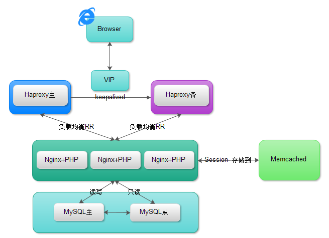
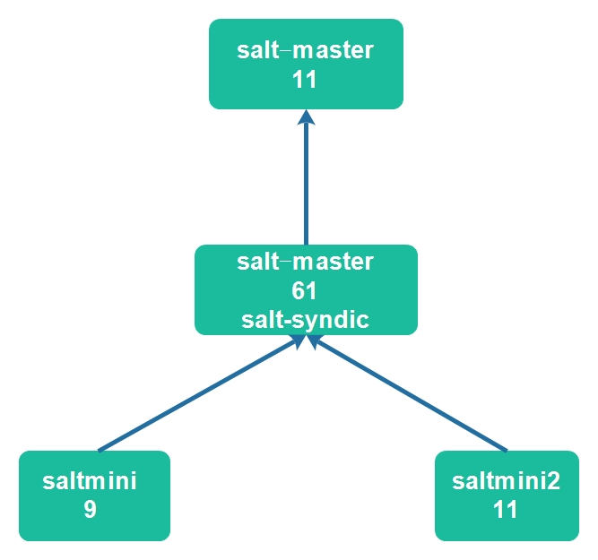

#Saltstack第二天
> 参考官方文档：[Saltstack官方模块文档](https://www.unixhot.com/docs/saltstack/ref)

##配置管理之状态模块pkg、file

1. 不可回退
2. 状态管理，可以多次执行(模版)

##SLS
Salt State 就是SLS（描述文件）YAML

> eg：
<pre>
[root@m01 /srv/salt]# cat web/apache.sls 
apache-install:      #名称ID声明，尽量有意义，默认是name声明
  pkg.installed:     #State声明，状态声明
    - names:         #选项声明
      - httpd
      - httpd-devel
apache-service:
  service.running:
    - name: httpd
    - enable: True
比如：
php:                 #这个默认就是name声明
  pkg.installed
</pre>

**一个ID声明下面，状态模块不能重复使用**

###比如：安装LAMP结构(简单例)
先要思考步骤

1. 安装软件包
2. 修改配置文件
3. 启动服务

<pre>
pkg.installed 安装
##同时安装多个包
common_packages:
  pkg.installed:
    - pkgs:
      - unzip
      - dos2unix
      - salt-minion: 2015.8.5-1.el6

pkg.latest 确保最新版本
pkg.remove 卸载
pkg.purge  卸载并删除配置文件
</pre>

####lamp-pkg
<pre>
lamp-pkg:
  pkg.installed:
    -pkgs:
      - httpd
      - php
      - mariadb-server
      - mysql
      - php-mysql
      - php-cli
      - php-mbstring

apache-config:
  file.managed:
    - name: /etc/httpd/conf/httpd.conf   #根据软件安装情况的配置文件目录
    - source: salt://files/httpd.conf    #当前环境(比如Base环境(目录起))
    - user: root
    - group: root
    - mode: 644
php-config:
  file.managed:
    - name: /etc/php.ini
    - source； salt://files/php.ini
    - user: root
    - group: root
    - mode: 644
mysql-config:
  file.managed:
    - name: /etc/my.cnf
    - source； salt://files/my.cnf
    - user: root
    - group: root
    - mode: 644
</pre>

**salt:// 表示当前环境的根目录**
**如下：表示base设置的目录**
eg:
<pre>
file_roots:
  base:
    - /srv/salt
</pre>

####service模块
<pre>
apache-service:
  service.running:
    - name: httpd
    - enable: True
    - reload: True

mysql-service:
  service.running:
    - name: mariadb-server
    - enable: True
    - reload: True
</pre>

**以上方式是安装步骤写，还可以按照服务来写，同一个服务的pkg,file,service模块写一起**

* 如：
<pre>
apache-config:
  pkg.installed:
    - pkgs:
      - httpd
      - php
      - php-mysql
      - php-cli
      - php-mbstring
  file.managed:
    - name: /etc/httpd/conf/httpd.conf
    - source: salt://lamp/files/httpd.conf
    - user: root
    - group: root
    - mode: 644
  service.running:
    - name: httpd
    - enable: True
    - reload: True
</pre>

####出错排查思路

* 将日志改成debug模式，以便查看详细信息
`log_level: debug`

* 将minion日志打开
* 如果minion端没有日志，可能有cache问题，重启下minion端

##状态间关系

1、我依赖谁   `require`
<pre>
apache-service:
  service.running:
    - name: httpd
    - enable: True
    - reload: True
    - require:
      - pkg: lamp-pkg
      - file: apache-config
</pre>

2、我被谁依赖   `require-in`

**意思就是我执行不成功，就不能执行被依赖项**
<pre>
mysql-config:
  file.managed:
    - name: /etc/my.cnf
    - source； salt://files/my.cnf
    - user: root
    - group: root
    - mode: 644
    - require-in:
      - service: mysql-service
</pre>

3、我监控谁   `watch`

**监控哪个项发生变动，然后做相应操作，有requier功能**
<pre>
apache-service:
  service.running:
    - name: httpd
    - enable: True
    - reload: True
    - require:
      - pkg: lamp-pkg
    - watch:
      - file: apache-config
</pre>
**如上：监控apache-config这个id的状态是否发生变动，如变动则执行reload操作（结合reload操作一起使用，如果不写reload则会默认变成重启）**

4、我被谁监控    `watch-in`
写到被监控的id上

5、我引用谁    `include`

将lamp-pkg这个id单独使用sls文件编写
<pre>
[root@m01 /srv/salt/lamp]# ll
total 20
-rw-r--r-- 1 root root  451 Jan 18 21:56 config.sls
drwxr-xr-x 2 root root 4096 Jan 18 20:46 files
-rw-r--r-- 1 root root  798 Jan 18 21:09 lamp.sls   #改名为init更好理解
-rw-r--r-- 1 root root  161 Jan 18 21:53 pkg.sls
-rw-r--r-- 1 root root  183 Jan 18 21:57 service.sls

[root@m01 /srv/salt/lamp]# cat lamp.sls 
include:
  - lamp.pkg
  - lamp.config
  - lamp.service

#模块化、分类化、方便化、原子化(写的小的不能再小，别的模块更方便依赖)
salt 'saltmini2' state.sls lamp.init
</pre>

6、我扩展谁

##如何编写SLS技巧

1. 按状态分类`如果单独使用，很清晰`
2. 按服务分类`可以被其他的SLS include。例如LNMP include mysql的服务`

推荐按照服务分类。方便include。

##Jinja模版

YAML-jinja

两种分隔符：``和`{{ ... }}`

使用模版需要三步：

1、告诉File模块，你要使用jinja

`- template: jinja`

2、列出参数选项
<pre>
- defaults:
  PORT: 88
</pre>

3、模版引用(母板)

`{{ PORT }}`

**模版中支持salt grinas pillar获取值**
1、写在模板文件中
####grains
grains获取的是列表，获取列表中的第一个值类似：
`Listen {{ grains['ipv4'][0] }}:{{ PORT }}`

####salt

salt远程执行：
`{{ salt['network.hw_addr']('eth0') }}`

####Pillar

`{{ pillar['apache'] }}`

**提示：变量一定要存在，以上是写在模版文件中**

####写在sls文件中（推荐）
<pre>
- defaults:
  PORT: 88
  IPADDR: {{ grains['ipv4'][0] }}
</pre>

##技巧：

1. 根据环境选择使用fqdn_ip4还是ipv4，推荐使用fqdn_ip4（唯一），多网卡多IP方便，在域名解析或者hosts文件中添加解析(master和minion端)，重启minion端grains获取静态数据。

作业：
所有的minion除去pillar中item rsyslog的值是server的minion

#案例

##Saltstack项目实战-系统初始化

头脑风暴：

1、系统初始化

2、功能模块：设置单独的目录 haproxy nginx php mysql memcached
> 尽可能的全、独立

3、业务模块：根据业务类型划分，例如web服务。论坛bbs

干活：

1、salt环境配置

开发、测试（功能测试环境、性能测试环境）、预生产、生产

base	基础环境

init目录，环境初始化： 

1、DNS配置 2、history记录时间 3、记录命令操作  4、内核参数优化  5、安装yum仓库 6、安装zabbix-agent 7、

<pre>
net.ipv4.ip_local_port_range:
  sysctl.present:
    - value: 10000 65000
fs.file-max:
  sysctl.present:
    - value: 2000000
net.ipv4.ip_forward:
  sysctl.present:
    - value: 1
vm.swappiness:
  sysctl.present:
    - value: 0      #尽量不使用swap

注：其中_local_port_range表示
#本地可用的端口范围，作为客户端发起连接的死后（如：负载均衡）。socket网络套接字，五元组包括：
源地址	源端口	目的地址	目的端口	协议
TCP	你要访问百度	x.x.x.x 9876	x.x.x.x 80
#默认取值相关
[root@m01 /srv/salt/base/init]# cat /proc/sys/fs/file-max 
44818
[root@m01 /srv/salt/base/init]# cat /proc/sys/vm/swappiness 
60

#最终tree
[root@m01 /srv/salt/base]# tree
.
├── init
│   ├── audit.sls
│   ├── dns.sls
│   ├── epel.sls
│   ├── files
│   │   ├── resolv.conf
│   │   └── zabbix_agentd.conf
│   ├── history.sls
│   ├── init.sls
│   ├── sysctl.sls
│   └── zabbix-agent.sls
└── top.sls

2 directories, 10 files
</pre>

prod	生产环境

####继续学习状态件关系：

1、unless：如果unless后边的命令返回的为真，就不执行(防止每次都执行)

2、onlyif(与上相反)

##管理任务
<pre>
saltutil.running
saltutil.kill_job <job id>

#查看/var/cache/salt/master/jobs缓存目录下任务及返回
salt-run jobs.list_jobs
salt-run jobs.lookup_jid
</pre>

##Masterless架构。无Master架构。

使用salt-call命令

saltstack安装salt-master,并使用上我们编写的案例

0、关闭salt-minion进程

1、修改minion配置文件
<pre>
配置为本地模式
#file_client: remote    默认是远程
file_client: local
file_roots
pillar_roots
</pre>

2、编写SLS

同上例中master一样的结构，这里只不过是本地执行，不是通过master下发任务。他只针对自己，所以不需要加'*'

3、salt-call --local state.highstate

##多master架构（Multi-Master）

需要同步的：
keys	master和minion的

file_roots

pillar_roots

<pre>
指定master
master:
  - 172.16.1.61
  - 172.16.1.62
</pre>

**SLS 使用git或者svn管理**

##Salt Syndic

1、Salt Syndic必须运行在一个Master上。

2、Syndic要连接另外一个Master，比它更高级的

**在salt-master上安装salt-syndic**
<pre>
#安装syndic
`yum install -y salt-syndic`
#master的配置文件
`syndic_master: 172.16.1.11`
#重启master和syndic进程
</pre>

**在11上安装master（配制成更高级的master）**
<pre>
#master配置文件中，告诉它它是更高级的master
order_masters: True
</pre>

**重点：**Syndic的file_roots和Pillar_roots必须与高级Master一致！

**缺点：**高级的Master不知道到底有多少minion。

##Salt-ssh

[salt-ssh官方文档](http://docs.saltstack.cn/topics/ssh/index.html)

##Salt-API
[API官方文档](http://docs.saltstack.cn/ref/netapi/all/index.html#all-netapi-modules)

1、必须是https的，所以要准备证书

2、配置文件

3、验证，使用PAM验证

4、启动salt-api

<pre>
#创建PAM验证的用户名
useradd -M -s /sbin/nologin saltapi
echo "saltapi"|passwd --stdin saltapi
#生成证书
cd /etc/pki/tls/certs
[root@m01 /etc/pki/tls/certs]# make testcert
##注：这里就是在/etc/pki/tls/private下生成localhosts.key，如果无法生成，查看是否有这个文件了。
cd /etc/pki/tls/private
openssl rsa -in localhost.key -out salt_nopass.key
[root@m01 /etc/pki/tls/private]# ll
total 8
-rw------- 1 root root 1766 Jan 31 15:11 localhost.key
-rw-r--r-- 1 root root 1679 Jan 31 15:13 salt_nopass.key
[root@m01 ~]# pip install CherryPy==3.2.6
#master配置文件中
default_include: master.d/*.conf
#配置cherrypy配置文件
[root@m01 /etc/salt/master.d]# cat api.conf
rest_cherrypy:
  host: 172.16.1.61
  port: 8000
  ssl_crt: /etc/pki/tls/certs/localhost.crt
  ssl_key: /etc/pki/tls/private/salt_nopass.key
#配置认证配置文件
[root@m01 /etc/salt/master.d]# cat eauth.conf
external_auth:
  pam:
    saltapi:
      - .*              #.*表示可以执行所有模块
      - '@wheel'
      - '@runner'
#重启master和api进程
/etc/init.d/salt-master restart
/etc/init.d/salt-api restart
[root@m01 /etc/salt/master.d]# netstat -unptl
Active Internet connections (only servers)
Proto Recv-Q Send-Q Local Address               Foreign Address             State       PID/Program name   
tcp        0      0 172.16.1.61:8000            0.0.0.0:*                   LISTEN      8309/salt-api -d
......

#验证
[root@m01 /etc/salt/master.d]# curl -k https://172.16.1.61:8000/login -H "Accept: application/x-yaml" -d username='saltapi' -d password='saltapi' -d eauth='pam'
return:
- eauth: pam
  expire: 1485893815.2547531
  perms:
  - .*
  - '@wheel'
  - '@runner'
  start: 1485850615.2547531
  token: ed21af9f55bdbab439e505cb94ec0d024af6b0f1
  user: saltapi
</pre>
**通过获取的token来进行交互**

<pre>
注：runner指的是在master端执行，local指的是在minion端执行
#进行资产收集
curl -sSk https://172.16.1.61:8000/minions/saltmini \
-H 'Accept: application/x-yaml' \
-H 'X-Auth-Token: ed21af9f55bdbab439e505cb94ec0d024af6b0f1'

#存活状态查询
curl -sSk https://172.16.1.61:8000/minions/saltmini \
-H 'Accept: application/x-yaml' \
-H 'X-Auth-Token: ed21af9f55bdbab439e505cb94ec0d024af6b0f1' \
-d client='runner' \
-d fun='manage.status'

#执行cmd.run
curl -k https://172.16.1.61:8000 \
-H 'Accept: application/x-yaml' \
-H 'X-Auth-Token: fbe698108a75c0c2f4f4eb7bceeff886710c0499' \
-d client=local \
-d tgt='*' \
-d fun=cmd.run \
-d arg='shutdown -h now'
</pre>

[github参考1](https://github.com/saltstack/pepper)
[github参考](https://github.com/binbin91/oms/blob/master/deploy/saltapi.py)
